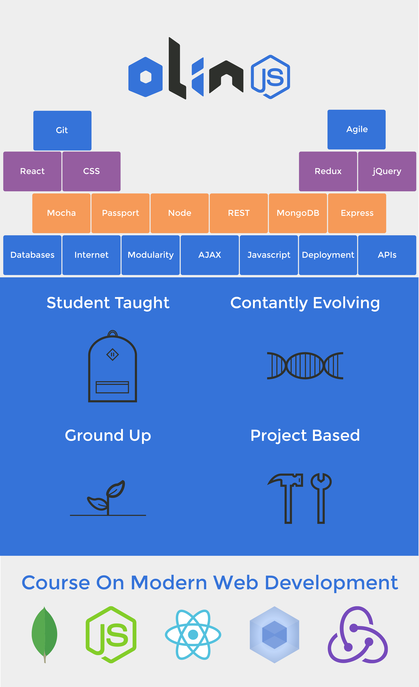

Olin.js
===

## Course Description
Olin.js is a project oriented approach to learning modern web application development. With server and client technology advancing so rapidly, the modern website looks very different from that of even a few years ago, and the web will only become a bigger part of our lives in the near future. Olin.js will quickly familiarize students with Node.js as a web server framework and ES5 JavaScript as a responsive client-side language with three weeks of introductory instruction and four weeks of partner labs.

Along the way, students will learn the basic layout of the web, how to deploy and maintain large applications, important development strategies, skills, and technologies, and how to design and manage complex, multi-developer software projects. Students will spend the last six weeks of the course putting their knowledge and skills to the test by designing and developing their own web applications.

### Learn Web Development
If you stumbled across this repository and feel like learning some web development, please follow along with us!
This repository contains all of the lesson material and assignments to get you going.
Feel free to submit a Github issue if you find any problems in the course and we'll do our best to fix it up.

## Course Contents
* [Lesson 0 - Getting Ready for the Course](./lessons/00-getting-ready)
* [Lesson 1 - Course Introduction and The Internet](./lessons/01-welcome-internet)
* [Lesson 2 - Express and Templating](./lessons/02-express-templating)
* [Lesson 3 - MongoDB](./lessons/03-mongo)
* [Lesson 4 - The Client](./lessons/04-client-jquery-ajax)
* [Lesson 5 - Burger App Help](./lessons/05-flex-burger-help)
* [Lesson 6 - Sessions, Users, Errors, CSS, and Debugging](./lessons/06-css-development-style)
* [Lesson 7 - Application Integration](./lessons/07-apis-debugging)
* [Lesson 8 - Unit Testing and Task Running](./lessons/08-tests-tasks)
* [Lesson 9 - Application Frameworks](./lessons/09-clientside-frameworks)
* [Lesson 10 - Deployment and Scaling](./lessons/10-deployment-scaling)
* [Lesson 11 - Security](./lessons/11-security)
* [Lesson 12 - Agile Project Management](./lessons/12-agile)
* [Lesson 13 - Architecture and Diagramming](./lessons/13-designs-diagrams)
* [Mini Project](./miniproject)
* [Final Project](./finalproject)

## Learning Objectives
1. Understand the modern internet and web applications
2. Learn software design skills and strategies, such as Javascript, Node and database technologies, that are relevant to web infrastructure
3. Find connections between current coursework with future professional applications
4. Learn software industry-related processes with a focuses on things, such as working on a team and communication of code and software projects
5. Balance scope and design decisions to complete a viable web application

[Course Syllabus](./Syllabus.md)
